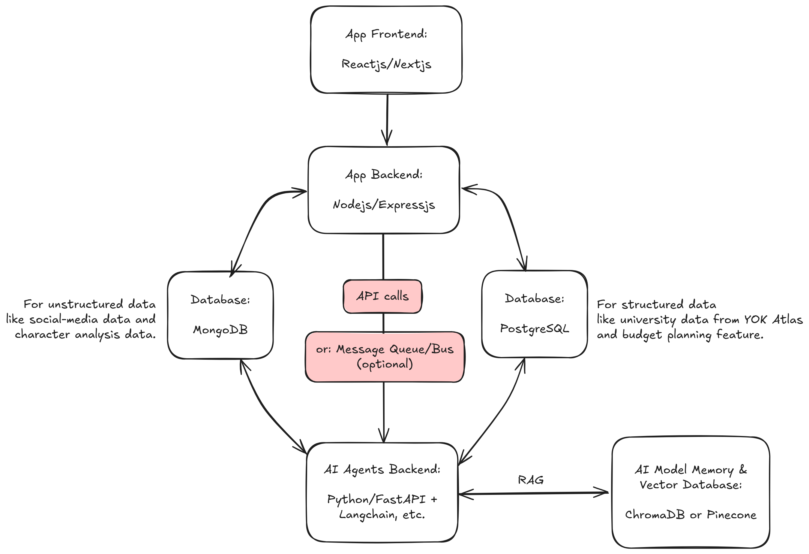

# IDPicker SaaS Project
Contained in monorepo. Production idea: docker containerized deployments of:
- frontend (TypeScript/ReactJS/NextJS)
- backend (TypeScript/NodeJS/ExpressJS)
- ai-backend (Python/FastAPI/Langchain/OpenAI)

## Project Idea Flow


## How to Deploy and Test
To deploy and test locally follow the below instructions:
1. Make sure you have Docker installed
2. From the root directory,
   1. run `docker compose up --build -d` the first time to build/rebuild the Docker image (usually needed if you want to update project dependencies)
   2. OR run `docker compose up -d` to spin up the containers bypassing the build phase (this is rather the default approach after you've built the Docker image at least once)

After spinning up the containers, during production, network access to the `backend` and `ai-backend` APIs are available on `localhost:3000` and `localhost:8080` respectively.

In production and in development, most public facing (frontend) API requests, authentication, and database query goes through the `backend` API. The `backend` API then makes AI inference calls to the `ai-backend` API through the shared bridge network (as all microservices `frontend`, `backend`, and `ai-backend` use the same Docker network).

## Currently Available API Endpoints
- **`backend`**
  - baseUrl: `/api`
    - **GET** `/` - App (backend) server root
      - `params`: *none*
      - `body`: *none*
      - Returns:
      ```json
      {
        "message": "IDPicker APP Server is running!"
      }
      ```
  - aiRoutes: `/api/ai`
    - **GET** `/` - AI (ai-backend) server root.
      - `params`: *none*
      - `body`: *none*
      - Returns:
      ```json
      {
        "success": true,
        "data": {
            "Hello World!": "IDPicker AI Inference Backend API is running!"
        }
      }
      ``` 
    - **GET** `/generate` - Quick AI generation.
      - `params`: *none*
      - `body`:
        - `query` *string*
        - `response_language` *string*
        - Example:
        ```json
        {
          "query": "Tell me something interesting about the Turkish tertiary education sector.",
          "response_language": "English"
        }
        ```
      - Returns:
      ```json
      {
        "success": true,
        "data": {
            "user": {
                "query": "Tell me something interesting about the Turkish tertiary education sector.",
                "response_language": "English"
            },
            "assistant": {
                "topic": "Turkish tertiary education",
                "summmary": "In Turkey, the first university, Istanbul University, was established in 1453, shortly after the Ottoman conquest of Constantinople. It is one of the oldest universities in the world and has played a significant role in shaping higher education in the region.",
                "popularity_rating": 8,
                "response_language": "English"
            }
        }
      }
      ```
      ```json
      {
        "success": true,
        "data": {
            "user": {
                "query": "As AI transforms the world on a rapid-scale, what is the Turkey education sector doing about training the next-generation to be AI-capable?",
                "response_language": "Turkish"
            },
            "assistant": {
                "topic": "Türkiye'de eğitim sektöründe yapay zeka eğitimi",
                "summmary": "Türkiye'de Milli Eğitim Bakanlığı, 2021 yılında ilk defa lise seviyesinde 'Yapay Zeka ve Veri Bilimi' seçmeli derslerini müfredata eklemiştir. Bu derslerle öğrenciler temel yapay zeka kavramları ve uygulamalarıyla tanışma fırsatı buluyor. Türkiye bu adımıyla yapay zeka eğitimine erken yaşta başlama konusunda öncülük eden ülkeler arasında yer almaktadır.",
                "popularity_rating": 7,
                "response_language": "Turkish"
            }
        }
      }
      ```
  - authRoutes: `api/auth`
    - *currently under development*

